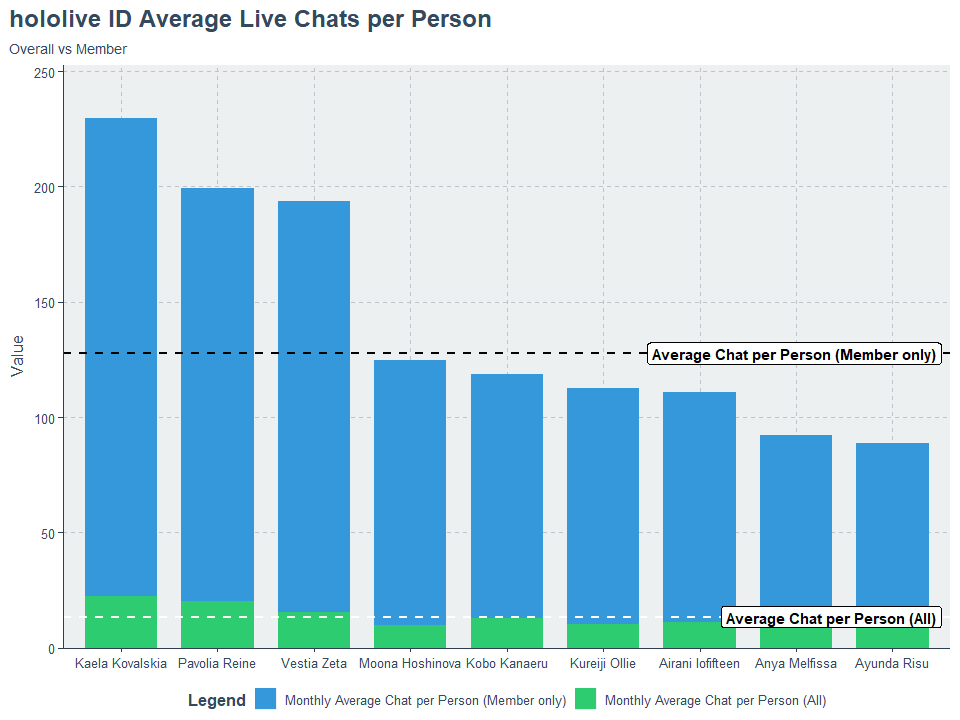

# An Overview into VTubers: Modern Days Influencer?

*Illustration assets by [hololive Production](https://en.hololive.tv/), [Crunchyroll](https://www.crunchyroll.com/it/anime-news/2021/10/06/vshojo-to-partner-with-nippon-tvs-v-clan-network), and LERTNITIVANIT on [Vecteezy](https://www.vecteezy.com/vector-art/3127954-abstract-template-blue-background-white-squares)*

## What are VTubers?

VTubers, or Virtual YouTubers, are online personas who use virtual avatars or characters to create content on platforms such as YouTube or Twitch. These avatars are often generated using motion capture technology or real-time animation software. [Kizuna AI](https://www.youtube.com/c/AIChannel) is widely considered to be the first popular VTuber. She was one of the first VTubers to gain widespread recognition, and is often credited with helping to bring attention to the VTuber phenomenon both within Japan and around the world.

There are two main divisions in the VTubers based on for whom they worked to: VTuber with an agency (also called Corporate VTuber) and Indie Vtuber. Corporate VTubers are managed by a company or agency that provides them with supports and resources, while Indie VTubers manage their works on their own. Corporate VTubers often have access to professional equipments and studios, as well as support for marketing, promotion, and audience engagement from their agency. 

*Top 5 most subscribed VTubers agencies*

They may also have access to collaborations and partnerships that an Indie VTuber might not be able to secure by themselves. However, Indie VTubers, have absolute control over their contents and do not obliged to share their earnings or revenue with an agency. Nonetheless, there are many Indie VTubers, such as [Pmaru-sama](https://www.youtube.com/@Pmarusama) and [Monarch](https://www.youtube.com/@LeeandLie), who gained popularity as much as Corporate VTubers.

*Most subscribed VTubers based on type*

Some VTubers also entitled themselves as VArtist and VSinger. VArtist and VSinger are two subcategories of VTuber that refers to the different types of contents they created. VArtists and VSingers have specific areas of focus and expertise that differentiate them from other types of VTubers. VArtists (Virtual Artists) are VTubers who create art-related contents such as drawing, painting, or digital arts. While, VSingers (Virtual Singers), are VTubers who specialize in singing and music-related contents.

## VTuber as Influencer

VTuber can be considered a subset of virtual influencers [1]. While some people defined influencers as a real person who influence others, VTubers characters present themselves as a real entity. They are also capable to influence their fans' interests, preferences, and behavior. They even retained partnership with well-known brands and companies, such as [Crunchyroll Hime](https://www.youtube.com/@CrunchyrollHime) and [Suntory Nomu](https://www.youtube.com/@-suntorynomu-1387). Considering their ability to reach, influence, and building their loyal audience through their contents and virtual presence, as well as managing their community, makes a VTuber on par with a *real* influencer.

As the VTubers phenomenon originated in Japan, which the majority of them were only speak Japanese, most of their audiences were also Japanese. However, subject to the COVID-19 pandemic lockdown in 2020, VTubers’ popularity were sky-rocketed [2]. In September 2020, [hololive Production](https://hololive.hololivepro.com/) released its first non-Japanese speaker VTubers as their branches hololive English and hololive Indonesia. With people staying at home and spending more time online, the demand for online entertainment increased, which supported VTubers to provide a unique and engaging content that resonated with many viewers.

One thing VTubers have in common is that they all use anime-themed models for their virtual avatars, this led to some negative stigmas. One of those, being assumed that VTubers’ audiences are made up of only anime fans. However, there is a study shows that VTuber’s audiences watched VTubers for the same reasons they watched any other content creators. They want to be entertained and go through unique experiences [2]. Despite the fact that there is certainly an overlap between VTubers audiences and anime fans, it would be inaccurate to assume that all VTubers’ audiences fit this description.

## Introduction to hololive ID

hololive ID, or hololive Indonesia, is one of the international branches of hololive Production. It was established in September 2020, and currently has 9 VTuber talents across three generations.

*Hololive ID talents’ channel statistics*

As of July 2022, the 3 topmost subscribed hololive ID VTubers are Kobo Kanaeru, Kureiji Ollie, and Moona Hoshinova. While Moona (1st gen) and Ollie (2nd gen) debuted in 2020, Kobo (3rd gen) secured first place within less than a year of her debut in 2022. Video count-wise (including shorts and live archives), Reine (2nd gen) and Risu (1st gen) are in first and second place respectively.

Other than hololive ID, many VTubers agencies have Indonesian talents such as NIJISANJI ID and MAHA5. But I will not discuss them, instead I will only focus on hololive ID.

### Live Streaming and Chats

Most of the VTubers do live streaming as their main content. Through live streaming, they can interact with their audiences in real-time, along to strengthen their online persona as influencer. The activity during live streaming itself may vary, such as playing video games, singing, drawing, doing ASMR, just chilling and talking to the viewers, role-playing, or even cooking! 

How about hololive ID’s live streaming and chat statistics? Take a look at the overview below.

*hololive ID talents’ live streaming chat statistics*

In terms of monthly average chats and chatters count during live streaming, Kobo surpassed all of the other hololive ID talents with a huge gap. You might also notice that Kaela tends to get more chats from relatively fewer chatters, and Ollie is the opposite of it.

*hololive ID talents’ live streaming chats growth*

Almost every talent has positive growth regarding their chats and chatters count during live streaming. As for the 3rd gen (Kaela, Kobo, and Zeta) the data displayed above might be biased due to lack of data, which only shown for 5 months long.

### Membership

YouTube offers a feature to help content creator build their community as well as encourage users to support their favorite content creator. In the context of VTubers, channel membership allows viewers to support their favorite VTubers by paying a monthly fee in exchange for various perks and benefits. These perks can include access to exclusive content, badges, emojis, and other special features that are only available to its members. Becoming a member of a VTuber's channel is entirely optional, and viewers can choose to join or leave at any time.

*Kobo Kanaeru’s channel membership preview*

So, how does channel membership affect the statistics?

*hololive ID talents’ live streaming chat from members statistics*

Although Kobo’s position is intact, the position for mid-tier talents have shifted. For instance, Moona and Reine, both tend to have a bigger ratio of chats and chatters count from members during live stream than its overall average.

*hololive ID talents’ live streaming chat from members and overall comparison*

Surprisingly, Kaela’s channel members have the highest average chats count per person, followed by Reine and Zeta in the 2nd and 3rd position. Kobo, on the other hand, has a slightly below-average chats rate though she has the highest average chats and chatters count during live streaming for both overall and member-only statistics.

### Live Superchats

YouTube provides another method to allow users to support their favorite content creator with the Super Chat feature. This feature lets live streamer’s viewers support the streamer directly by purchasing live chat messages with real money. The purchased live chat messages are highlighted and pinned to the top of the chat for a certain amount of time, depending on the amount of money they paid. VTubers and all live streamers in general, would most likely read the Super Chat messages and respond to them during the stream, giving the viewer a chance to be noticed.

*YouTube super chat tiers and advantages list [3]*

In a comparison of similar features, Twitch has the Bits feature. Twitch Bits serves a similar purpose to support users’ favorite streamers during a live stream. Twitch Bits is a virtual currency that viewers can purchase and then use to send Cheer messages (similar to YouTube Super Chat) during a stream. Although they are similar in terms of functionality, YouTube takes more revenue share from Super Chat than Twitch takes from Bits purchases. By the time this article was written, YouTube takes 30% of Super Chat revenue [4]. Twitch, on the other hand, takes around 29% of Bits purchases or even less when users purchased a large number of Bits [5].

How much did hololive ID VTubers earned from Super Chat?

*hololive ID talents’ live streaming super chats amount statistics*

Zeta, Ollie, and Kaela have the highest average Super Chats earnings with more than 1M Japanese Yen per month or roughly Rp110.000.000 (assuming 1 JPY = 110 IDR). Numbers mentioned is the gross values before YouTube’s cut and other possible deductions.

*hololive ID talents’ live streaming super chat statistics*

Another view we can observe is both Kaela and Zeta have the highest average Super Chats amount per person. In contrast, Kobo has the smallest average Super Chats amount per person (less than 1500 JPY) though she has the highest average Super Chatters count per month. Looking back, Kaela and Zeta share similar attributes for not only having high average chats per member, but also having high average super chats count and earnings. This might indicate that Kaela’s and Zeta’s audiences are stickier and more loyal than the other talents’ audiences. In the marketing field, having this particular advantage is great since it can lead to potential business opportunities.

### Audience Sentiment

In general, most VTubers audiences are highly supportive and enthusiastic, as they enjoy the unique and engaging content that VTubers provided. Many VTubers have worked hard to build a strong community of loyal fans. These fans are typically supportive and positive, and they enjoy interacting with the VTuber and other fans in a positive and friendly environment. However, like any online community, there can be instances of toxicity or negativity among its audiences. Some viewers may engage in any trolls, harassment, or other negative behaviors toward the VTuber itself or other members of the community.

Take a look at these numbers.

*hololive ID talents’ audience sentiment*

The highest banned chatters rate during live streaming was taken by Kaela’s audiences, with roughly 47 people banned per 10.000 people per month. Live chatters could be banned due to violation of live streaming chat rules and guidelines. This might be ironic since Kaela also has the highest average chats per person during live streaming. Risu has the highest deleted chats rate during live streaming with 107 chats deleted per 100.000 live chats per month. Deleted chats shared the same reason as banned chatters, such as containing hate speech, the use of offensive language, having toxic sentiments, or might be depending on the live stream chat moderator’s judgment.

## hololive ID VTubers in the Influencer Market

Let’s say that you are a KOL specialist from a certain brand and looking for an influencer to promote your brand. You are intrigued to try to work with VTuber influencers from hololive ID. You wondered which VTuber would be a fit for your brand. Well, of course, there are many things to be considered, yet I do not have the answer to that question. BUT, here I will show you how are the position of hololive ID VTubers in the influencer market based on their activity on YouTube, especially their live streaming. *Hope you can gain insights and this might inspire you with something~*

### Positioning, Principal Component Analysis (PCA), and Biplot

**Market positioning** is a marketing strategy to position a brand or product concerning its competitors and create a unique perception in the mind of consumers [6]. In terms of influencers, it refers to the way that influencers are positioned in the market compared to their competitors.

**Principal Component Analysis (PCA)** is a statistical technique used to reduce the dimensionality of a large data set. The main purposes of performing PCA are dimensionality reduction, identifying patterns, visualizing data, and preprocessing data (removing noise or overcoming multicollinearity). 

**Biplot analysis** is an exploratory technique using a graph to visualize the relationship between variables and observations in a data set. PCA and biplot analysis are often used together as a way to visualize and understand high-dimension data sets. By performing PCA on the data and using the resulting principal components to create a biplot, it is possible to identify the most important variables in the data and visualize how the observations are related to its variables.

Market positioning can be represented graphically using tools such as perceptual maps, which show how different brands are positioned in the minds of consumers based on specific attributes or characteristics. Biplot is one of many types of perceptual maps [7]. Using these attributes (in the table below), let’s see how hololive ID VTubers are positioned in the influencer market.

| Associated Attribute | Variable Name | Detail |
| --- | --- | --- |
| Chatters engagement | `chats` | Average live streams’ chats count |
| Chatters engagement growth | `chats_growth` | Average growth of live streams’ chats count |
| Chatters reach | `uniqueChatters` | Average live streams’ chatters count |
| Chatters reach growth | `uniqueChatters_growth` | Average growth of live streams’ chatters count |
| Members engagement | `memberChats_rate` | Average members’ chats to all chats during live streams ratio |
| Members reach | `uniqueMembers_rate` | Average live streams’ chats from members to chats from all ratio |
| Interaction from chatters | `chat_per_person` | Average live streams’ chats per person |
| Interaction from members | `memberchat_per_person` | Average live streams’ chats per person (from member) |
| Chatters willingness to pay* | `SCamountPerPerson` | Average super chats amount per person |
| Lots of spenders* | `SCunique_rate` | Average super chatters to all chatters ratio |

**) Derived from super chat stats only*

### Biplot Result

Using the attributes mentioned above, here is the biplot analysis for hololive ID VTubers.

*hololive ID talents’ biplot positioning map*

- **Kobo Kanaeru** is positioned as having strong chatters engagement and chatters reach, and also high growth in both attributes. As a newcomer in hololive ID, Kobo successfully derived a differentiation of her image in the positioning map. This might be due to her character’s behavior and uniqueness which made her gain many followers and engagement within a short time.
- **Kaela Kovalskia** and **Vestia Zeta** have similar strong attributes (shown by their relatively close positions) which are related to interaction from members as well as overall chatters. It seems their audiences are quite enthusiastic towards their live streams, also it might be because of their unique characteristics during live streaming which made their viewers behave like so.
- **Pavolia Reine** has a strong attribute which is having audiences who spent a lot. **Kureiji Ollie** has a similar image but is not as strong as Reine’s. However, Ollie also has the image of having audiences who have a high willingness to pay. Zeta seems to have a similar image in this particular attribute.
- **Anya Melfissa** and **Airani Iofifteen** have similar images which related to members’ reach and engagement. This implies both of them have loyal members who consistently interact with them during live streams.
- **Ayunda Risu** and **Moona Hoshinova** also have similar images to Anya and Iofi, though theirs are not as strong as Anya’s and Iofi’s. This implies Risu and Moona do not have a strong image just yet and have a chance to derive their uniqueness so they can differentiate their position if they wanted to.

## Closing Thoughts

VTubers as influencers might sound naive back then, but nowadays their presence is all around us. Some of them might have their associated brands, and some others have not. But in the context of influencing, their ability to reach and influence their fans through their contents and virtual presence is real. Considering the demand for online entertainment that is constantly increasing, there is a vast room for them to grow inside the influencer market. For hololive ID VTubers, some of them have tremendously high growth, some of the others have stickier audiences, and so on. These attributes sum up their uniqueness and advantages to compete in the influencer market. Also, I believe that their creativity and behavior, which are reflected in their personas, will continue to be the main attraction point for their audiences for now and in the future.

***So, which VTubers fit to your brand? :)***

## References

### Data Source

Y. Uechi, ‘VTuber 1B: Large-scale Live Chat and Moderation Events Dataset’. Feb-2022.

### General References

[1] D. Mancuso, “The Rise of VTubers as Social Media Influencers, Explained,” *Virtual Humans*, Dec. 15, 2020. https://www.virtualhumans.org/article/the-rise-of-vtubers-as-social-media-influencers-explained (accessed Feb. 07, 2023).

[2] D. Li, “The Rise of VTubers: An Overview of the Surging Popularity of ‘Virtual YouTubers,’” *The Science Survey*, Jul. 24, 2022. https://thesciencesurvey.com/arts-entertainment/2022/07/24/the-rise-of-vtubers-an-overview-of-the-surging-popularity-of-virtual-youtubers/ (accessed Feb. 07, 2023).

[3] K. Severin, “YouTube’s Super Chat Is A Guerrilla Marketing Gift To Advertisers,” *MIDiA Research*. https://www.midiaresearch.com/blog/youtubes-super-chat-is-a-guerilla-marketing-gift-to-advertisers (accessed Feb. 09, 2023).

[4] YouTube Help, “Manage YouTube Super Chat & Super Stickers for Live Chat - YouTube Help,” *support.google.com*. https://support.google.com/youtube/answer/7288782? (accessed Feb. 09, 2023).

[5] Twitch, “Purchase Bits - Twitch,” *www.twitch.tv*. https://www.twitch.tv/bits (accessed Feb. 09, 2023).

[6] Dan, “Market Positioning,” *https://strategiccfo.com/*, Jul. 24, 2013. https://strategiccfo.com/articles/profitability/market-positioning/ (accessed Feb. 15, 2023).

[7] R. D. Prastowo, “Principal Component Analysis with Biplot Analysis in R,” *Medium*, Apr. 12, 2022. https://medium.com/@RaharditoDP/principal-component-analysis-with-biplot-analysis-in-r-ee39d17096a1 (accessed Feb. 15, 2023).

[8] D. Bryant, “The Benefits of Displaying Product or Group Differences Using Biplots,” *Ironwood Insights*, May 05, 2021. https://www.ironwoodinsights.com/blog/post/benefits-displaying-product-or-group-differences-using-biplots (accessed Feb. 15, 2023).
